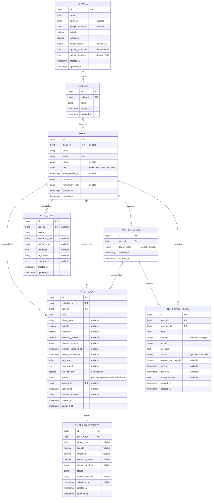
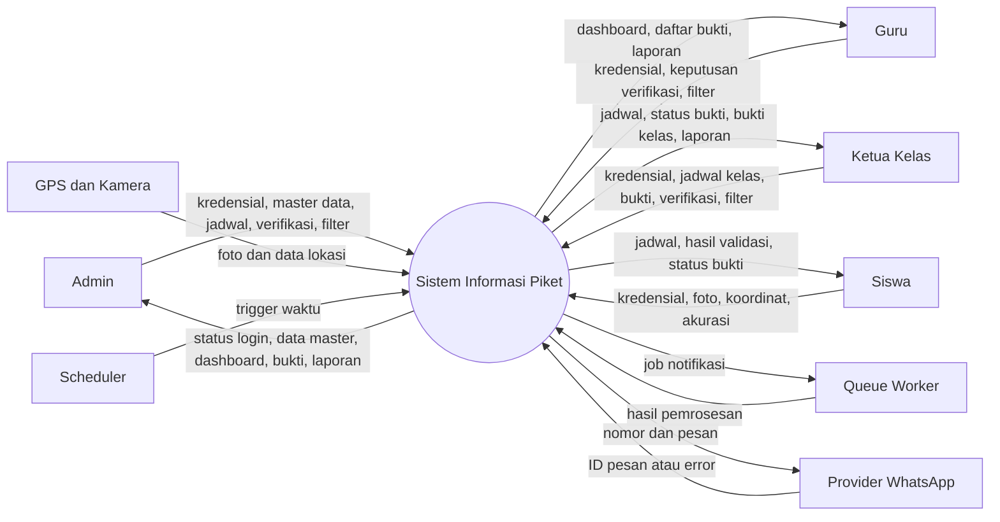
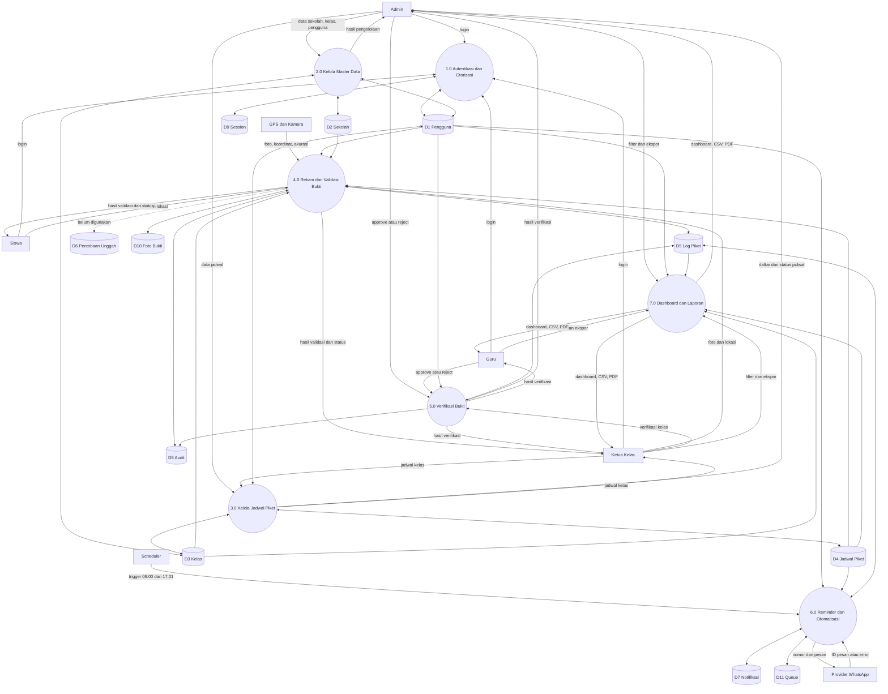
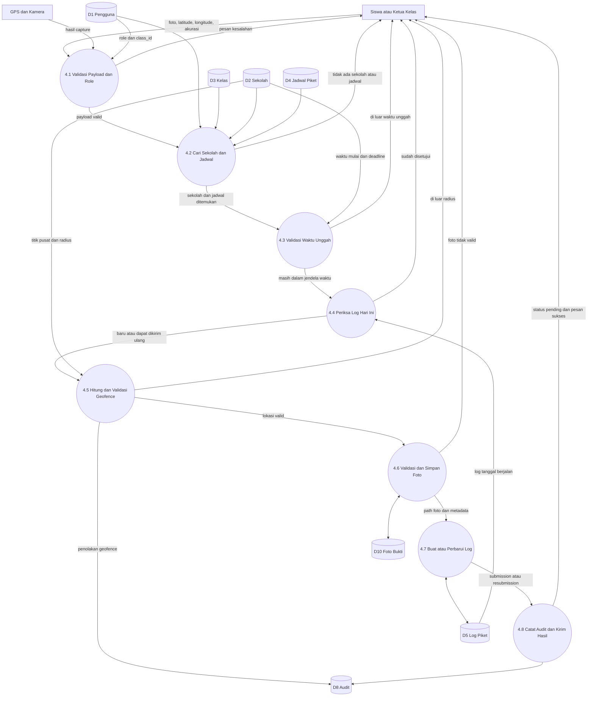
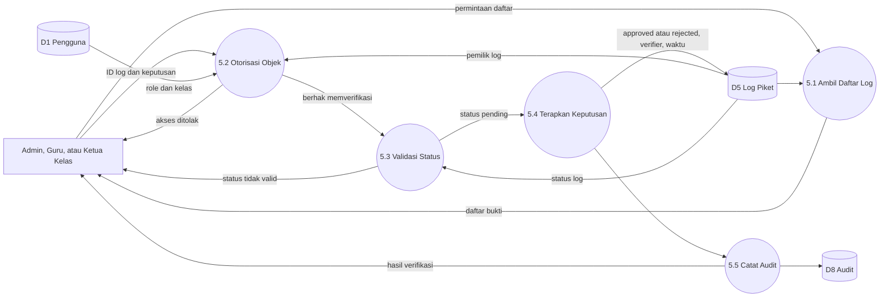
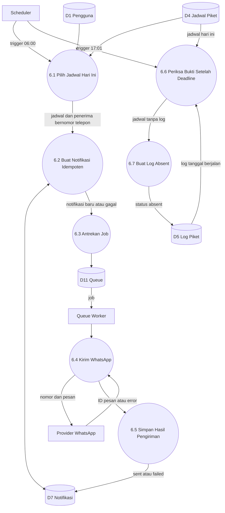

# ERD dan DFD Sistem Informasi Piket

Dokumen ini menggambarkan struktur data dan aliran data aplikasi berdasarkan implementasi saat ini (`as-is`). Diagram menggunakan Mermaid dan dapat dirender langsung oleh GitHub atau editor yang mendukung Mermaid.

## 1. Ruang Lingkup

Sistem Informasi Piket digunakan untuk:

- mengelola sekolah, kelas, pengguna, dan jadwal piket;
- mengirim pengingat piket melalui WhatsApp;
- menerima foto bukti piket beserta koordinat GPS;
- memvalidasi jadwal, waktu unggah, akurasi GPS, dan geofence sekolah;
- memverifikasi bukti piket;
- menandai ketidakhadiran secara otomatis; dan
- menampilkan serta mengekspor laporan piket.

### Aktor

| Aktor | Peran utama |
|---|---|
| Admin | Mengelola master data, jadwal, verifikasi, dan laporan |
| Guru | Memverifikasi bukti dan melihat laporan |
| Ketua kelas (`km`) | Mengelola jadwal kelas, mengunggah bukti, memverifikasi bukti kelas, dan melihat laporan |
| Siswa | Melihat jadwal, mengunggah bukti, dan menerima pengingat |
| Scheduler | Memicu pengingat dan penandaan ketidakhadiran |
| Queue worker | Memproses antrean pengiriman WhatsApp |
| Provider WhatsApp | Mengirim pesan pengingat ke pengguna |
| GPS dan kamera | Menyediakan lokasi, akurasi, dan foto bukti |

## 2. Entity Relationship Diagram

### 2.1 ERD Domain

### 2.2 Kardinalitas dan Aturan Relasi

| Relasi | Kardinalitas | Aturan |
|---|---|---|
| `schools` ke `classes` | 1 : 0..N | Kelas wajib berada di satu sekolah; penghapusan sekolah menghapus kelas |
| `classes` ke `users` | 1 : 0..N | Kelas pengguna opsional pada database; penghapusan kelas membuat `class_id` bernilai `NULL` |
| `users` ke `piket_schedules` | 1 : 0..N | Satu pengguna dapat memiliki beberapa jadwal pada hari berbeda |
| `piket_schedules` ke `piket_logs` | 1 : 0..N | Jadwal berulang dapat menghasilkan log pada banyak tanggal |
| `users` ke `piket_logs` | 1 : 0..N | Setiap log memiliki satu pelaksana |
| `users` ke `piket_logs.verified_by` | 1 : 0..N | Verifikator bersifat opsional |
| `piket_logs` ke `piket_log_attempts` | 1 : 0..N | Satu log dapat memiliki beberapa percobaan unggah |
| `users` ke `notification_logs` | 1 : 0..N | Setiap notifikasi memiliki satu penerima |
| `piket_schedules` ke `notification_logs` | 1 : 0..N | Jadwal dapat memicu notifikasi pada tanggal berbeda |
| `users` ke `audit_logs` | 1 : 0..N | Aktor audit bersifat opsional setelah pengguna dihapus |

### 2.3 Unique Constraint

| Tabel | Constraint | Tujuan |
|---|---|---|
| `classes` | `UNIQUE(school_id, name)` | Nama kelas unik dalam satu sekolah |
| `users` | `UNIQUE(email)` | Email akun tidak boleh sama |
| `piket_schedules` | `UNIQUE(user_id, day_of_week)` | Pengguna hanya memiliki satu jadwal per hari |
| `piket_logs` | `UNIQUE(schedule_id, date)` | Satu jadwal hanya memiliki satu log per tanggal |
| `notification_logs` | `UNIQUE(user_id, schedule_id, date, channel)` | Mencegah notifikasi ganda |

### 2.4 Catatan ERD

- `audit_logs.auditable_type` dan `audit_logs.auditable_id` adalah referensi polymorphic logis, bukan foreign key database.
- `piket_logs.user_id` semestinya sama dengan pengguna pada `piket_schedules.user_id`, tetapi konsistensi ini tidak dijamin oleh constraint database.
- Tabel `piket_log_attempts` sudah tersedia, tetapi alur unggah saat ini masih memperbarui `piket_logs` secara langsung dan belum menyimpan riwayat ke tabel tersebut.
- Tabel infrastruktur Laravel seperti `sessions`, `cache`, `jobs`, dan `failed_jobs` tidak dimasukkan ke ERD domain agar diagram tetap fokus.

## 3. DFD Diagram Konteks

## 4. DFD Level 0

### Data Store

| Kode | Data store | Implementasi |
|---|---|---|
| D1 | Pengguna | `users` |
| D2 | Sekolah dan konfigurasi geofence | `schools` |
| D3 | Kelas | `classes` |
| D4 | Jadwal piket | `piket_schedules` |
| D5 | Pelaksanaan dan verifikasi piket | `piket_logs` |
| D6 | Riwayat percobaan unggah | `piket_log_attempts` |
| D7 | Riwayat notifikasi | `notification_logs` |
| D8 | Audit aktivitas | `audit_logs` |
| D9 | Session autentikasi | `sessions` |
| D10 | Foto bukti | `storage/app/public/piket` |
| D11 | Antrean pekerjaan | `jobs`, `failed_jobs`, `job_batches` |

## 5. DFD Level 1 - Unggah Bukti Piket

### Aturan Proses Unggah

1. Hanya pengguna dengan role `siswa` atau `km` yang dapat mengunggah bukti.
2. Pengguna harus memiliki kelas, sekolah, dan jadwal pada hari berjalan.
3. Akurasi GPS maksimum adalah 300 meter.
4. Waktu unggah mengikuti `upload_start_time` dan `upload_deadline` sekolah.
5. Jarak dihitung dari koordinat pengguna ke titik sekolah menggunakan rumus Haversine.
6. Jarak harus berada dalam `radius_meters` sekolah.
7. Foto harus berupa JPEG, PNG, atau WebP dengan ukuran maksimum 5 MB.
8. Log yang sudah `approved` tidak dapat dikirim ulang.
9. Submission baru atau resubmission disimpan dengan status `pending`.

## 6. DFD Level 1 - Verifikasi Bukti

## 7. DFD Level 1 - Reminder dan Ketidakhadiran

### Aturan Otomatisasi

- Reminder dijalankan setiap pukul 06:00.
- Pengguna tanpa nomor telepon dilewati.
- Notifikasi dibuat secara idempoten untuk kombinasi pengguna, jadwal, tanggal, dan kanal.
- Pengiriman gagal dapat dicoba ulang oleh queue worker.
- Pemeriksaan ketidakhadiran dijalankan pukul 17:01.
- Status `absent` dibuat hanya jika belum ada log untuk jadwal dan tanggal tersebut.
- Log berstatus `pending` atau `rejected` tetap dianggap sudah melakukan submission sehingga tidak diubah menjadi `absent`.

## 8. Matriks Proses dan Hak Akses

| Proses | Admin | Guru | Ketua kelas | Siswa | Sistem |
|---|:---:|:---:|:---:|:---:|:---:|
| Login dan dashboard | Ya | Ya | Ya | Ya | - |
| Kelola sekolah | Ya | - | - | - | - |
| Kelola kelas | Ya | - | - | - | - |
| Kelola pengguna | Ya | - | - | - | - |
| Kelola jadwal | Ya | - | Ya, sesuai kelas | - | - |
| Unggah bukti | - | - | Ya | Ya | - |
| Verifikasi bukti | Ya | Ya | Ya, sesuai kelas | - | - |
| Lihat dan ekspor laporan | Ya | Ya | Ya | - | - |
| Kirim reminder | - | - | - | - | Ya |
| Tandai absent | - | - | - | - | Ya |

## 9. Catatan Implementasi As-Is

- Riwayat `piket_log_attempts` belum diisi oleh proses unggah atau kirim ulang.
- Pembatasan laporan berdasarkan kelas untuk role ketua kelas belum diterapkan secara otomatis pada query laporan.
- Pesan reminder menyebut deadline pukul 17:00 secara statis, sedangkan setiap sekolah mempunyai konfigurasi `upload_deadline`.
- Route unggah `POST /piket/upload` terdaftar lebih dari satu kali pada konfigurasi route saat ini.
- Relasi audit ke objek yang diaudit bersifat logis melalui `auditable_type` dan `auditable_id`.

## 10. Traceability

| Proses | Implementasi utama |
|---|---|
| Autentikasi | `app/Http/Controllers/AuthController.php` |
| Otorisasi role | `app/Http/Middleware/EnsureUserHasRole.php` |
| Master sekolah | `app/Http/Controllers/SchoolController.php` |
| Master kelas | `app/Http/Controllers/SchoolClassController.php` |
| Master pengguna | `app/Http/Controllers/UserController.php` |
| Jadwal piket | `app/Http/Controllers/ScheduleController.php` |
| Unggah dan geofence | `app/Http/Controllers/PiketController.php`, `app/Services/GeoService.php` |
| Verifikasi | `app/Http/Controllers/VerificationController.php` |
| Dashboard | `app/Http/Controllers/DashboardController.php` |
| Laporan | `app/Http/Controllers/ReportController.php` |
| Reminder | `app/Console/Commands/SendPiketReminders.php` |
| Pengiriman WhatsApp | `app/Jobs/SendPiketReminderJob.php`, `app/Services/WhatsAppService.php` |
| Penandaan absent | `app/Console/Commands/MarkPiketAbsent.php` |
| Jadwal otomatis | `bootstrap/app.php` |
| Route aplikasi | `routes/web.php` |
| Struktur database | `database/migrations` |
